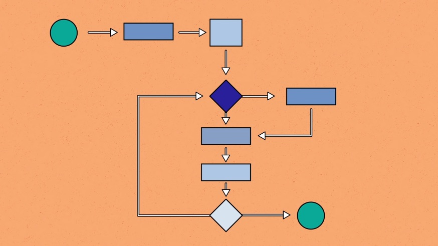

<!--
*** Thanks for checking out the Best-README-Template. If you have a suggestion
*** that would make this better, please fork the repo and create a pull request
*** or simply open an issue with the tag "enhancement".
*** Don't forget to give the project a star!
*** Thanks again! Now go create something AMAZING! :D
-->

<!-- PROJECT SHIELDS -->
<!--
*** I'm using markdown "reference style" links for readability.
*** Reference links are enclosed in brackets [ ] instead of parentheses ( ).
*** See the bottom of this document for the declaration of the reference variables
*** for contributors-url, forks-url, etc. This is an optional, concise syntax you may use.
*** https://www.markdownguide.org/basic-syntax/#reference-style-links
-->
[![Contributors][contributors-shield]][contributors-url]
[![Forks][forks-shield]][forks-url]
[![Stargazers][stars-shield]][stars-url]
[![Issues][issues-shield]][issues-url]
[![MIT License][license-shield]][license-url]
[![LinkedIn][linkedin-shield]][linkedin-url]

<!-- PROJECT LOGO -->
 

  

  <h3 align="center">Algorithm and Design Project Family</h3>

  

    This project family is about algorithms' designs and implementations. This project includes more than 70 kinds of algorithm introduced by online tutorials, websites, textbooks, documentations and other resources. This page includes a complete description for algorithms and other programs. To find the implementation file, please look at the file name provides on the back side of different modules.
     
    <a href="https://github.com/daijingz/Algorithm-and-Design/tree/main/Documentation"><strong>Explore the docs »</strong></a>
     
     
    <a href="https://github.com/daijingz/Algorithm-and-Design/tree/main">View Demo</a>
    ·
    <a href="#contact">Report Bug</a>
    ·
    <a href="https://github.com/daijingz/Algorithm-and-Design/tree/main">Request Feature</a>
  

<!-- TABLE OF CONTENTS -->

  
Table of Contents

  <ol>
    <li>
      <a href="#about-the-project">About The Project</a>
    </li>
    <li>
      <a href="#getting-started">Getting Started</a>
      <ul>
        <li><a href="#prerequisites">Prerequisites</a></li>
        <li><a href="#installation">Installation</a></li>
      </ul>
    </li>
    <li><a href="#usage">Usage</a></li>
    <li><a href="#roadmap">Roadmap</a></li>
    <li><a href="#contributing">Contributing</a></li>
    <li><a href="#license">License</a></li>
    <li><a href="#contact">Contact</a></li>
    <li><a href="#acknowledgments">Acknowledgments</a></li>
  </ol>

<!-- ABOUT THE PROJECT -->
## About The Project

**This project family includes those parts**

:open_mouth: **Algorithm implementations** (How do algorithm perform in the different programming languages?)

:smile: **Algorithm-based Application programs** (Apply algorithms to application programs)

:grimacing: **Documentations** (files that explain content, mainly **_.ipynb_** and **_.md_** files)

:blush: **Mathematical proofs** (algortihms' theory proofs, mostly based on selected textbooks)

:smiley: **Testing** (Testing that checks whether each program has good, expected performance)

Of course, no one template will serve all projects since your needs may be different. So I'll be adding more in the near future. You may also suggest changes by forking this repo and creating a pull request or opening an issue.

Every repository has the `README.md` file to briefly explain what does this repository do.

(<a href="#top">back to top</a>)

### Mainly Used Programming Languages

* [Python](https://www.python.org/) (With Pytest, PyGame, Scipy, Numpy, Pandas, matplotlib)
* [Java](https://www.java.com/en/) (With JUnit, java.sql, GUI)
* [C++](https://docs.microsoft.com/en-us/cpp/?view=msvc-170) (Application programs and gaming programs)
* [C](https://docs.microsoft.com/en-us/cpp/?view=msvc-170) (Mainly about operating systems)
* [Ruby](https://www.ruby-lang.org/en/documentation/) (High-Level programming languages)
* [Haskell](https://hoogle.haskell.org/) (High-Level programming languages)
* [Scala](https://docs.scala-lang.org/) (High-Level programming languages)
* [SQL](https://docs.microsoft.com/en-us/sql/?view=sql-server-ver15) (Azure, mySQL, and Oracle)

(<a href="#top">back to top</a>)

### Statistics

**Total lines** - 9344 lines

**Current Modules** - 10 parts (modules)

(<a href="#top">back to top</a>)

## Repository

<!-- LICENSE -->
## License

**_This part is from the README file template provider, NOT from the author_**

Distributed under the MIT License. See `LICENSE.txt` for more information.

(<a href="#top">back to top</a>)

<!-- CONTACT -->
## Contact

Jingze Dai - [@your_twitter](https://twitter.com/your_username) - david1147062956@gmail.com

Project Link: [https://github.com/your_username/repo_name](https://github.com/your_username/repo_name)

(<a href="#top">back to top</a>)

<!-- ACKNOWLEDGMENTS -->
## Acknowledgments

**_This part is from the README file template provider, NOT from the author_**

Use this space to list resources you find helpful and would like to give credit to. I've included a few of my favorites to kick things off!

* [Choose an Open Source License](https://choosealicense.com)
* [GitHub Emoji Cheat Sheet](https://www.webpagefx.com/tools/emoji-cheat-sheet)
* [Malven's Flexbox Cheatsheet](https://flexbox.malven.co/)
* [Malven's Grid Cheatsheet](https://grid.malven.co/)
* [Img Shields](https://shields.io)
* [GitHub Pages](https://pages.github.com)
* [Font Awesome](https://fontawesome.com)
* [React Icons](https://react-icons.github.io/react-icons/search)

(<a href="#top">back to top</a>)

<!-- MARKDOWN LINKS & IMAGES -->
<!-- https://www.markdownguide.org/basic-syntax/#reference-style-links -->
[contributors-shield]: https://img.shields.io/github/contributors/othneildrew/Best-README-Template.svg?style=for-the-badge
[contributors-url]: https://github.com/othneildrew/Best-README-Template/graphs/contributors
[forks-shield]: https://img.shields.io/github/forks/othneildrew/Best-README-Template.svg?style=for-the-badge
[forks-url]: https://github.com/othneildrew/Best-README-Template/network/members
[stars-shield]: https://img.shields.io/github/stars/othneildrew/Best-README-Template.svg?style=for-the-badge
[stars-url]: https://github.com/othneildrew/Best-README-Template/stargazers
[issues-shield]: https://img.shields.io/github/issues/othneildrew/Best-README-Template.svg?style=for-the-badge
[issues-url]: https://github.com/othneildrew/Best-README-Template/issues
[license-shield]: https://img.shields.io/github/license/othneildrew/Best-README-Template.svg?style=for-the-badge
[license-url]: https://github.com/othneildrew/Best-README-Template/blob/master/LICENSE.txt
[linkedin-shield]: https://img.shields.io/badge/-LinkedIn-black.svg?style=for-the-badge&logo=linkedin&colorB=555
[linkedin-url]: https://linkedin.com/in/othneildrew
[product-screenshot]: images/screenshot.png
